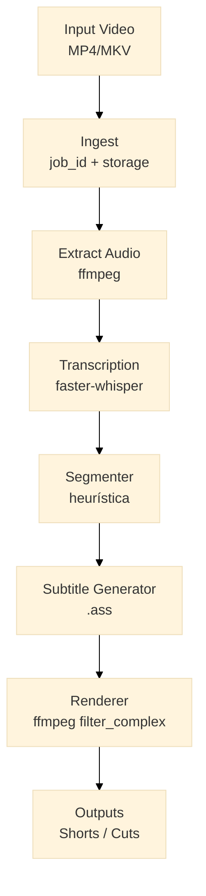
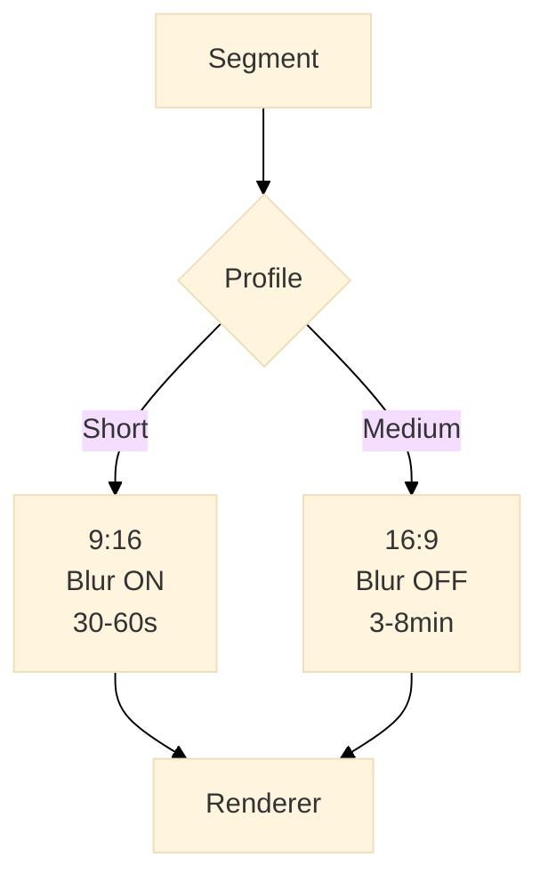

# Auto Video Cutter

Cortes automáticos de vídeos para Shorts / Reels / TikTok  
CPU-only, determinístico — pipeline batch assíncrono para gerar vídeos verticais a partir de vídeos longos sem edição manual.

## Sumário
- Objetivo
- Visão geral da arquitetura
- Stack
- Estrutura de diretórios
- Pipeline técnico (detalhado)
- Configuração & execução
- Boas práticas e decisões de design
- Extensões futuras

---

## 1. Objetivo do projeto
Automatizar a geração de short vertical (30–60s) a partir de vídeos longos (ex.: podcasts), com foco em:
- performance e baixo custo (CPU-only)
- previsibilidade e determinismo
- saída de qualidade "assistível"
- pipeline automático (não é um editor manual)

Principais restrições: sem GPU, sem tracking facial, sem frontend obrigatório.

---

## 2. Visão geral da arquitetura




```
Input Video
   ↓
Ingest
   ↓
Audio Extraction
   ↓
Transcription (Whisper)
   ↓
Segmenter (heurística)
   ↓
Renderer (FFmpeg)
   ↓
Shorts Outputs
```

Características:
- Arquitetura batch
- Processamento assíncrono (jobs isolados)
- CLI / API opcional
- Workers stateless controlados por RQ/Redis

---

## 3. Stack
- Linguagem: Python 3.11+
- Áudio/Vídeo: FFmpeg (filter_complex)
- Transcrição: faster-whisper (CPU)
- Jobs: Redis + RQ (Redis Queue)
- Legendas: ASS (Advanced SubStation Alpha), burn-in via FFmpeg
- Render: Scale + blur de fundo, overlay do foreground, burn-in das legendas

IA:
- Whisper: obrigatório
- LLM: opcional (feature flag desligada por padrão)

---

## 4. Estrutura de diretórios (exemplo)
```
auto-video-cutter/
├── app/
│   ├── ingest/         # criação do job e input
│   ├── audio/          # extração de áudio
│   ├── transcribe/     # faster-whisper
│   ├── segment/        # heurística de cortes
│   ├── subtitles/      # gerador de .ass
│   ├── render/         # renderer (ffmpeg filter_complex)
│   ├── jobs/           # worker RQ
│   ├── models/         # dataclasses / pydantic
│   └── settings.py     # configs/env
├── storage/
│   └── jobs/{job_id}/
│       ├── input.mp4
│       ├── audio.wav
│       ├── transcript.json
│       ├── segments.json
│       ├── subtitles/segment_01.ass
│       └── outputs/short_01.mp4
├── docker/
│   ├── Dockerfile
│   └── docker-compose.yml
├── main.py
├── requirements.txt
└── README.md
```

---

## 5. Pipeline técnico (detalhado)

### 5.1 Ingest
- Recebe vídeo longo
- Gera job_id e diretório isolado
- Enfileira job no Redis/RQ

### 5.2 Extração de áudio
Comando recomendado:
```bash
ffmpeg -i input.mp4 -vn -ac 1 -ar 16000 audio.wav
```
- Mono, 16 kHz — formato ideal para Whisper

### 5.3 Transcrição
- faster-whisper (modelos small/medium)
- Output: JSON com frases e timestamps
Exemplo:
```json
{ "start": 120.4, "end": 128.7, "text": "isso é um ponto importante" }
```

### 5.4 Segmentação (heurística)
Objetivo: cortes coerentes sem ML pesado.
Regras:
- Duração alvo definida pelo perfil ativo (ex.: short 30–60s, medium 3–8min)
- Preferir cortes em pontuação final (. ? !)
- Ignorar segmentos muito curtos
- Agrupar frases consecutivas quando necessário

Exemplo de saída:
```json
[
    { "start": 120.4, "end": 178.2 },
    { "start": 190.0, "end": 245.6 }
]
```

### 5.5 Geração de legendas (.ASS)
- Um arquivo .ass por segmento
- Estilo no header (Fonte: Roboto/Montserrat, cor clara, outline preto grosso, centralizado)
- Gerado em Python; burn-in realizado no FFmpeg para performance e portabilidade

### 5.6 Renderização (FFmpeg)
Estratégia visual:
- Split do vídeo em foreground (centro) + background (scale + blur)
- Overlay do foreground sobre o fundo desfocado
- Burn-in do .ass para legenda
- Áudio: copiado ou reencodificado (AAC simples)

Exemplo (esquemático) filter_complex:
- escala do background → blur
- escala e crop do foreground → overlay
- ass burn-in → mapa de saída

## 5.7 Perfis de corte (Short / Medium / Long)



O pipeline não é restrito a shorts.  
A lógica de segmentação e renderização é **parametrizada por perfil de saída**.

Cada perfil define:
- duração mínima/máxima do segmento
- aspect ratio
- estratégia visual (blur ou original)
- estilo de legenda

Exemplo conceitual de perfis:

- Short:
  - duração: 30–60s
  - aspect: 9:16
  - visual: scale + blur background

- Medium:
  - duração: 3–8 minutos
  - aspect: 16:9
  - visual: vídeo original (sem blur)

A arquitetura permanece a mesma; apenas parâmetros de segmentação e renderização variam.

---

## 6. Jobs e paralelismo
- 1 job = 1 vídeo longo
- RQ controla concorrência e retries
- Workers stateless, isolados por job_id
- Retry simples em caso de falha

---

## 7. Configurações
Arquivo .env com variáveis principais:
- PATHS (storage/jobs)
- WHISPER_MODEL (small/medium)
- MIN_SEGMENT_DURATION / MAX_SEGMENT_DURATION
- ENABLE_LLM=false

Exemplo mínimo:
```
STORAGE_PATH=/data/jobs
WHISPER_MODEL=small
ENABLE_LLM=false
```

---

## 8. Requisitos de execução

### Obrigatórios

- Sistema operacional:
  - Linux (recomendado)
  - macOS (suportado)
  - Windows (via Docker ou WSL2)

- Runtime:
  - Python 3.11+
  - FFmpeg (build com suporte a libx264)

- Hardware:
  - CPU com suporte a AVX (recomendado)
  - 8 GB RAM (mínimo funcional)

- Serviços:
  - Redis (para fila de jobs)

### Opcionais

- GPU:
  - Não necessária
  - Pode ser usada futuramente para acelerar Whisper (fora do escopo atual)

- Docker:
  - Recomendado para ambiente reprodutível
  - Não obrigatório

- LLM local:
  - Ollama (desativado por padrão)
  - Usado apenas como extensão futura para seleção de cortes

---

## 9. Execução (rápido)
Com Docker Compose (exemplo):
- docker-compose up --build
- Enfileirar jobs via CLI: python main.py ingest /path/to/input.mp4

Sem Docker:
- pip install -r requirements.txt
- configurar .env
- rodar worker: python -m app.jobs.worker
- enfileirar job: python main.py ingest ...

---

## 10. O que o projeto não faz (por design)
- Editor visual
- Face tracking
- Animação complexa de legendas
- Ranking emocional automático
- Uso obrigatório de GPU

Decisão intencional para simplicidade, previsibilidade e performance em CPUs.

---

## 11. Extensões futuras (plugáveis)
- LLM para seleção/agrupamento de cortes
- Ranking de segmentos
- Upload automático (YouTube / TikTok)
- UI mínima opcional

---

## 12. Princípios de engenharia
- Determinismo > hype
- FFmpeg > processamento frame-a-frame em Python
- Heurística primeiro, IA depois
- Automatizar fluxos ao invés de “embelezar” manualmente