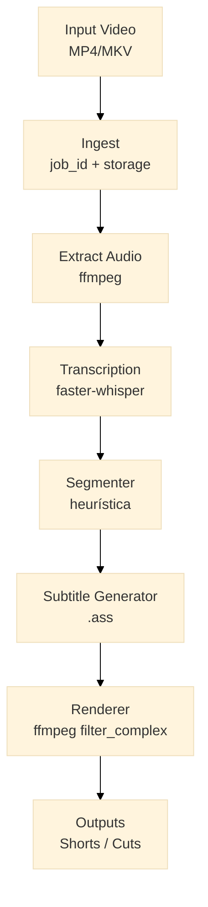
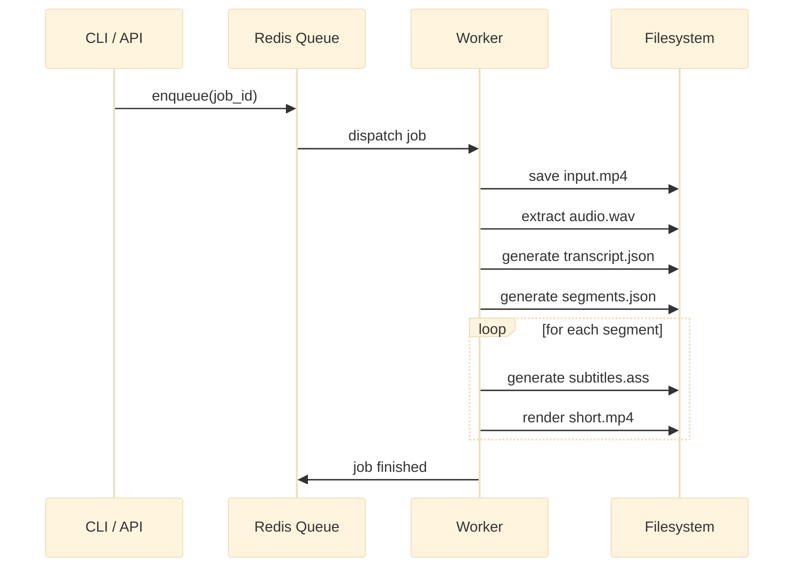
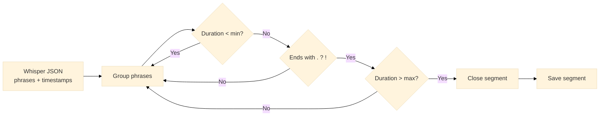
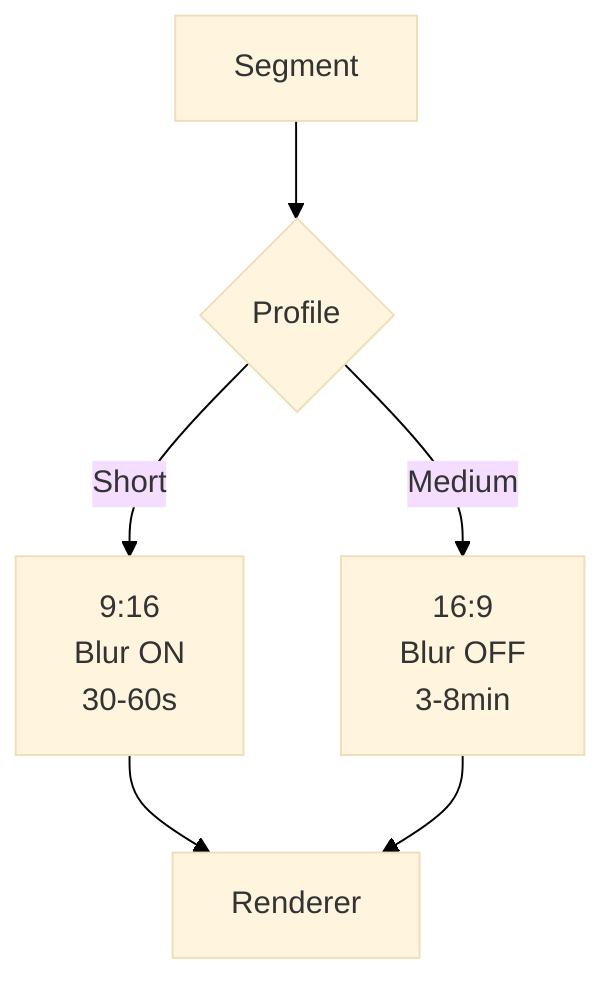
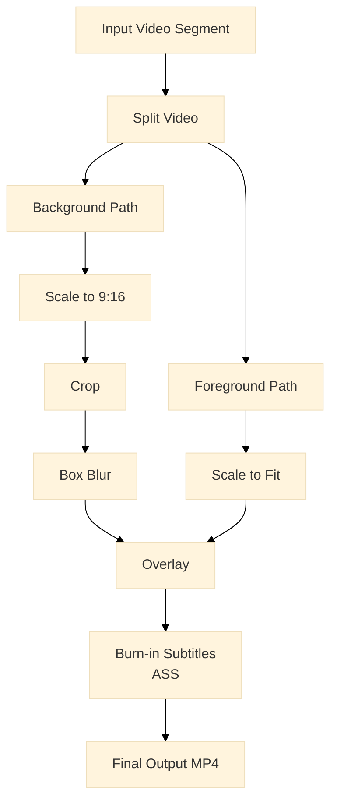
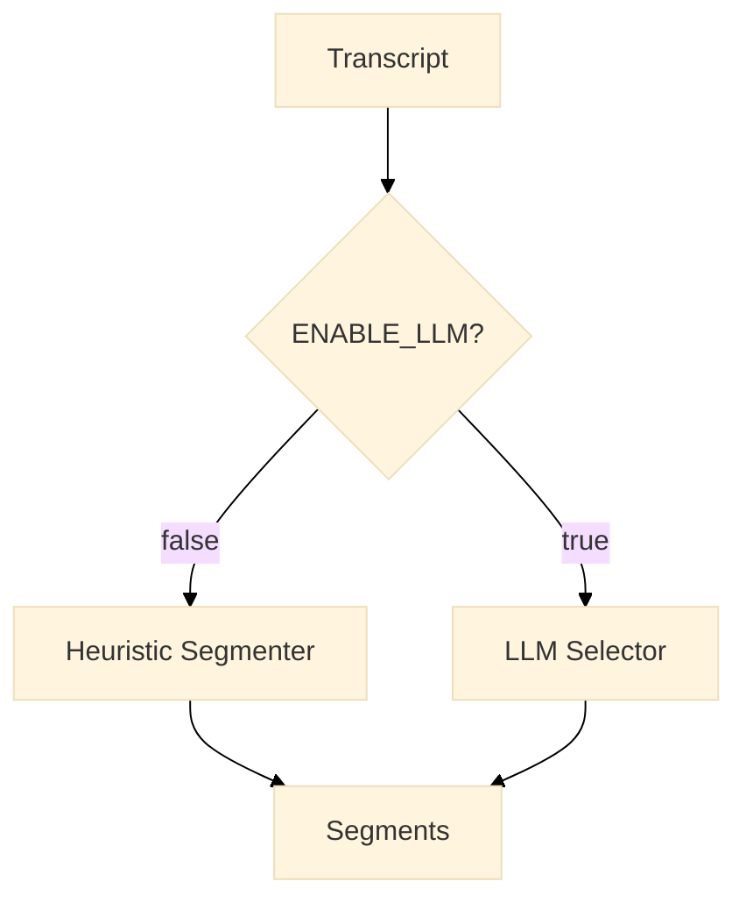

# Architecture Overview

This document describes the architecture, design decisions, and execution flow of **auto-video-cutter**.

The goal of this system is to automatically generate video cuts (shorts or long-form clips) from long videos using a **deterministic, CPU-only, high-performance pipeline**.

---

## 1. Architectural Principles

The system is designed around the following principles:

- **Automation first**: zero manual editing
- **Determinism over hype**: predictable outputs
- **Performance-aware**: FFmpeg over Python frame processing
- **Cost-free**: CPU-only, local execution
- **Extensibility**: features are plug-in, not hard-wired

---

## 2. High-Level Pipeline

The system operates as a batch processing pipeline.  
Each input video is processed independently as a **job**.



Key stages:
1. Ingest video and create isolated job workspace
2. Extract audio optimized for speech recognition
3. Transcribe audio using Whisper
4. Segment transcript using deterministic heuristics
5. Generate styled subtitles (.ass)
6. Render final clips using FFmpeg

---

## 3. Job-Based Execution Model

Each video is processed as a single job in a queue.

- Jobs are **stateless**
- Workers can scale horizontally
- Failures affect only one job
- No shared mutable state



This model allows safe retries and parallel execution.

---

## 4. Storage Layout

Each job has its own isolated directory:

```
storage/jobs/{job_id}/
├── input.mp4
├── audio.wav
├── transcript.json
├── segments.json
├── subtitles/
│ └── segment_01.ass
└── outputs/
└── segment_01.mp4
```

This guarantees:
- traceability
- reproducibility
- easy debugging

---

## 5. Transcription Layer

Audio is extracted and normalized before transcription.

- Mono
- 16 kHz sample rate
- Optimized for Whisper accuracy

The transcription output is a structured JSON containing:
- text
- start timestamp
- end timestamp

This data becomes the **single source of truth** for segmentation.

---

## 6. Segmentation Strategy

Segmentation is heuristic-based by design.

Goals:
- avoid heavy ML models
- keep execution fast and deterministic
- ensure semantic coherence

Rules:
- group consecutive phrases
- close segments only on `. ? !`
- enforce min/max duration per profile
- discard low-content segments



LLM-based segmentation is intentionally disabled by default and treated as an optional extension.

---

## 7. Output Profiles

The renderer supports multiple output profiles.

Examples:
- Shorts (9:16, 30–60s, blur background)
- Medium clips (16:9, 3–8 min, no blur)

Profiles control:
- segment duration
- aspect ratio
- background strategy
- subtitle style



---

## 8. Rendering Engine

Rendering is fully handled by **FFmpeg** using `filter_complex`.

Rendering steps:
1. Split video into background and foreground
2. Scale and blur background
3. Scale foreground to fit
4. Overlay foreground on background
5. Burn-in subtitles (.ass)



This approach avoids:
- face tracking
- destructive crops
- frame-by-frame Python processing

---

## 9. Subtitle System (.ASS)

Subtitles are generated as `.ass` files to allow:

- font control
- outline and shadow
- precise positioning
- high-performance burn-in

This is significantly faster and more reliable than Python-based video rendering libraries.

---

## 10. Asynchronous Processing

The system uses:
- Redis
- RQ (Redis Queue)

Characteristics:
- simple configuration
- predictable execution
- easy debugging
- minimal operational overhead

---

## 11. Feature Flags and Extensions

Optional features are implemented via feature flags.

Examples:
- LLM-based segment selection
- Multi-output rendering
- Auto-upload to platforms



This prevents overengineering while keeping the system extensible.

---

## 12. What This Architecture Explicitly Avoids

By design, the system does **not** include:

- Web UI
- Visual editor
- GPU dependency
- Emotion detection
- Face tracking
- Animated captions

These decisions favor reliability and maintainability.

---

## 13. Summary

This architecture prioritizes:

- simplicity
- performance
- deterministic behavior
- engineering trade-offs made explicit

It is designed to scale **in complexity only when justified**, not by default.

---
